# Polyglot Codebase Knowledge Graph

> Generated offline by **readmenator**. Supports C, C++, Python, Go, Rust, JS/TS, Java, C#, Shell, PHP, Dart, GDScript, Nim, ASM.
> No LLMs. No tokens. Pure static analysis. See more [here](https://github.com/grisuno/ReadMenator)

**Total Files Parsed:** 4 | **Total Symbols Extracted:** 7 | **Total Imports:** 12

## Structural Knowledge Map

```mermaid
graph TD
    classDef mod fill:#1e1e1e,stroke:#ff6666,stroke-width:2px,color:#fff;
    classDef cls fill:#2d2d2d,stroke:#4ec9b0,stroke-width:2px,color:#fff;
    classDef fn fill:#333,stroke:#dcdcaa,stroke-width:1px,color:#dcdcaa;
    classDef ext fill:#111,stroke:#666,stroke-dasharray:5 5,color:#aaa;
    Feigenbaum_Mandelbrot_py["Feigenbaum_Mandelbrot.py (py)"]
    class Feigenbaum_Mandelbrot_py mod;
    Feigenbaum_Mandelbrot_py_logistic["logistic"]
    class Feigenbaum_Mandelbrot_py_logistic fn;
    Feigenbaum_Mandelbrot_py --> Feigenbaum_Mandelbrot_py_logistic
    Feigenbaum_Mandelbrot_py_feigenbaum["feigenbaum"]
    class Feigenbaum_Mandelbrot_py_feigenbaum fn;
    Feigenbaum_Mandelbrot_py --> Feigenbaum_Mandelbrot_py_feigenbaum
    Feigenbaum_Mandelbrot_py_mandelbrot["mandelbrot"]
    class Feigenbaum_Mandelbrot_py_mandelbrot fn;
    Feigenbaum_Mandelbrot_py --> Feigenbaum_Mandelbrot_py_mandelbrot
    Feigenbaum_Mandelbrot_py_create_combined_plot["create_combined_plot"]
    class Feigenbaum_Mandelbrot_py_create_combined_plot fn;
    Feigenbaum_Mandelbrot_py --> Feigenbaum_Mandelbrot_py_create_combined_plot
    app_py["app.py (py)"]
    class app_py mod;
    app_py_calculate_feigenbaum["calculate_feigenbaum"]
    class app_py_calculate_feigenbaum fn;
    app_py --> app_py_calculate_feigenbaum
    app2_py["app2.py (py)"]
    class app2_py mod;
    app2_py_calculate_feigenbaum["calculate_feigenbaum"]
    class app2_py_calculate_feigenbaum fn;
    app2_py --> app2_py_calculate_feigenbaum
    zoom_py["zoom.py (py)"]
    class zoom_py mod;
    zoom_py_calculate_feigenbaum["calculate_feigenbaum"]
    class zoom_py_calculate_feigenbaum fn;
    zoom_py --> zoom_py_calculate_feigenbaum
    ext_numpy["numpy"]
    class ext_numpy ext;
    Feigenbaum_Mandelbrot_py -.->|imports| ext_numpy
    ext_matplotlib_pyplot["matplotlib.pyplot"]
    class ext_matplotlib_pyplot ext;
    Feigenbaum_Mandelbrot_py -.->|imports| ext_matplotlib_pyplot
    ext_mpl_toolkits_mplot3d["mpl_toolkits.mplot3d"]
    class ext_mpl_toolkits_mplot3d ext;
    Feigenbaum_Mandelbrot_py -.->|imports| ext_mpl_toolkits_mplot3d
    ext_pygame["pygame"]
    class ext_pygame ext;
    app_py -.->|imports| ext_pygame
    ext_sys["sys"]
    class ext_sys ext;
    app_py -.->|imports| ext_sys
    app_py -.->|imports| ext_numpy
    app2_py -.->|imports| ext_pygame
    app2_py -.->|imports| ext_sys
    app2_py -.->|imports| ext_numpy
    zoom_py -.->|imports| ext_pygame
    zoom_py -.->|imports| ext_sys
    zoom_py -.->|imports| ext_numpy
```

---

## Architecture Reference

### PY (4 files)

#### `Feigenbaum_Mandelbrot.py`
**Path:** `Feigenbaum_Mandelbrot.py`

**Functions:**
- `logistic` (line 7) `def logistic(r, x)`
- `feigenbaum` (line 11) `def feigenbaum(r_min, r_max, n_iter, n_skip)`
- `mandelbrot` (line 27) `def mandelbrot(x_min, x_max, y_min, y_max, max_iter)`
- `create_combined_plot` (line 43) `def create_combined_plot()`

#### `app.py`
**Path:** `app.py`

**Functions:**
- `calculate_feigenbaum` (line 17) `def calculate_feigenbaum()`

#### `app2.py`
**Path:** `app2.py`

**Functions:**
- `calculate_feigenbaum` (line 17) `def calculate_feigenbaum()`

#### `zoom.py`
**Path:** `zoom.py`

**Functions:**
- `calculate_feigenbaum` (line 18) `def calculate_feigenbaum()`
