# Polyglot Codebase Knowledge Graph

> Generated offline by **readmenator**. 4 files, 7 symbols, 12 imports. Supports C, C++, Python, Go, Rust, JS/TS, Java, C#, Shell, PHP, Dart, GDScript, Nim, ASM, Ruby, Swift, Kotlin, Scala, Lua, Elixir.
> No LLMs. No tokens. Pure static analysis. See more [here](https://github.com/grisuno/ReadMenator)

**Start here:** Statistics Dashboard for scope, God Nodes for blast radius, Architecture Reference for per-file API. Agents: prefer `readmenator-agent/INDEX.md` + `SYMBOLS.md`.

**Wiki:** prefer `readmenator-wiki/index.md` for progressive disclosure: one synthesis page per community, `connections.json` with EXTRACTED vs INFERRED confidence, `queries.md` log, `REPORT.md` audit.

**Confidence:** EXTRACTED = parsed from source, INFERRED = heuristic bridge, AMBIGUOUS = reported, never hidden. See `readmenator-wiki/REPORT.md`.

**Total Files Parsed:** 4 | **Total Symbols Extracted:** 7 | **Total Imports:** 12

<!-- ranking_model: v1.0 | weights: {ppr:0.45,auth:0.2,test:0.15,doc:0.1,fresh:0.1} | alpha:0.85 | commit:b3ca3bb | date:2026-07-18 -->


## Table of Contents

1. [Statistics Dashboard](#statistics-dashboard)
2. [Architectural Layers](#architectural-layers)
3. [Ranked Context](#ranked-context)
4. [God Nodes](#god-nodes)
5. [Suggested Questions](#suggested-questions)
6. [Hotspot Analysis](#hotspot-analysis)
7. [Change Impact Analysis](#change-impact-analysis)
8. [Suggested Linting Rules](#suggested-linting-rules)
9. [Orphans](#orphans)
10. [Query Recipes](#query-recipes)
11. [Structural Knowledge Map](#structural-knowledge-map)
12. [UML Class Diagram](#uml-class-diagram)
13. [Code Property Graph](#code-property-graph)
14. [Architecture Reference](#architecture-reference)
    - [PY (4 files)](#py-4-files)

---

## Statistics Dashboard

| Metric | Value |
|--------|-------|
| Total Files | 4 |
| Total Symbols | 7 |
| Total Imports | 12 |
| Call Edges | 37 |
| Inheritance Edges | 0 |
| Languages | 1 |
| Avg Symbols/File | 1.8 |
| Avg Imports/File | 3.0 |

### Top Files by Import Count (Fan-Out)

| File | Imports | Symbols | Language |
|------|---------|---------|----------|
| `Feigenbaum_Mandelbrot.py` | 3 | 4 | py |
| `app.py` | 3 | 1 | py |
| `app2.py` | 3 | 1 | py |
| `zoom.py` | 3 | 1 | py |

---

## Architectural Layers

Auto-detected from path patterns, naming conventions, and imported frameworks.

| Layer | Files |
|-------|-------|
| utility | 4 |

### utility

- `Feigenbaum_Mandelbrot.py` (py, 4 symbols)
- `app.py` (py, 1 symbols)
- `app2.py` (py, 1 symbols)
- `zoom.py` (py, 1 symbols)

---

## Ranked Context

Files ranked by composite score for the current query context. The ranking combines Personalized PageRank (query relevance), global authority, test coverage, documentation coverage, and code freshness. Model: v1.0.

| Rank | File | Composite | PPR | Authority | Test | Doc |
|------|------|-----------|-----|-----------|------|-----|
| 1 | `Feigenbaum_Mandelbrot.py` | 0.0250 | 0.0000 | 0.0000 | 0.00 | 0.25 |
| 2 | `app.py` | 0.0000 | 0.0000 | 0.0000 | 0.00 | 0.00 |
| 3 | `app2.py` | 0.0000 | 0.0000 | 0.0000 | 0.00 | 0.00 |
| 4 | `zoom.py` | 0.0000 | 0.0000 | 0.0000 | 0.00 | 0.00 |

---

## God Nodes

Most architecturally central files ranked by combined import/export degree and symbol richness.

| File | Score | Connections | PageRank |
|------|-------|-------------|----------|
| `Feigenbaum_Mandelbrot.py` | 0.4 | | 0.0000 |
| `app.py` | 0.1 | | 0.0000 |
| `app2.py` | 0.1 | | 0.0000 |
| `zoom.py` | 0.1 | | 0.0000 |

---

## Suggested Questions

Auto-generated exploration prompts based on graph structure:

- What does Feigenbaum_Mandelbrot.py depend on, and what depends on it? (0 connections)
- What does app.py depend on, and what depends on it? (0 connections)
- What does app2.py depend on, and what depends on it? (0 connections)
- What is the overall architecture of this codebase?

---

## Hotspot Analysis

Files ranked by combined complexity (symbol count) and centrality (connection count). High-scoring files are architecturally critical and may need refactoring attention.

| File | Complexity | Centrality | Combined | Symbols | Connections |
|------|-----------|------------|----------|---------|-------------|
| `Feigenbaum_Mandelbrot.py` | 1.000 | 1.000 | 1.000 | 4 | 3 |
| `app.py` | 0.250 | 1.000 | 0.700 | 1 | 3 |
| `app2.py` | 0.250 | 1.000 | 0.700 | 1 | 3 |
| `zoom.py` | 0.250 | 1.000 | 0.700 | 1 | 3 |

---

## Change Impact Analysis

Files sorted by how many other files would be affected if they changed. High-impact files should be changed with caution.

| File | Direct Dependents | Transitive Dependents | Total Impact |
|------|------------------|----------------------|--------------|
| `Feigenbaum_Mandelbrot.py` | 0 | 0 | 0 |
| `app.py` | 0 | 0 | 0 |
| `app2.py` | 0 | 0 | 0 |
| `zoom.py` | 0 | 0 | 0 |

---

## Suggested Linting Rules

Automatically suggested linting and security rules based on patterns detected in the codebase. These can be exported as Semgrep rules using the `--export-rules` flag.

| Rule ID | Severity | Description | Language | Matches |
|---------|----------|-------------|----------|---------|
| `RM001` | info | Large number of functions in py: 7 total | py | 7 |

---

## Orphans

Files with no documentation or low connectivity. These are candidates for documentation investment or cleanup.

- `app.py` (1 symbols, no doc)
- `app2.py` (1 symbols, no doc)
- `zoom.py` (1 symbols, no doc)

---

## Query Recipes

Example queries you can run against this knowledge base using the ranking engine:

```
# Find files most relevant to a concept
readmenator query "Where is the import resolver implemented?"

# Rank files by relevance to a topic
readmenator query "How does documentation generation work?"

# Explain why a file ranks highly
readmenator query "explain readmenator/_documentation.py"

# Trace dependency paths with ranked context
readmenator query "path from CLI to exporter"
```

The ranking model uses the following signals:

- **Personalized PageRank** (45% weight): query-specific relevance via seed propagation
- **Global Authority** (20% weight): structural importance via standard PageRank
- **Test Coverage** (15% weight): fraction of symbols referenced in test files
- **Doc Coverage** (10% weight): presence of docstrings and file-level docs
- **Freshness** (10% weight): recent modification activity

Results include score decomposition and justification paths for each ranked item.

---

## Structural Knowledge Map

```mermaid
graph TD
    classDef mod fill:#1e1e1e,stroke:#ff6666,stroke-width:2px,color:#fff;
    classDef cls fill:#2d2d2d,stroke:#4ec9b0,stroke-width:2px,color:#fff;
    classDef fn fill:#333,stroke:#dcdcaa,stroke-width:1px,color:#dcdcaa;
    classDef ext fill:#111,stroke:#666,stroke-dasharray:5 5,color:#aaa;
    Feigenbaum_Mandelbrot_py["Feigenbaum_Mandelbrot.py (py)"]
    class Feigenbaum_Mandelbrot_py mod;
    Feigenbaum_Mandelbrot_py_logistic["logistic"]
    class Feigenbaum_Mandelbrot_py_logistic fn;
    Feigenbaum_Mandelbrot_py --> Feigenbaum_Mandelbrot_py_logistic
    Feigenbaum_Mandelbrot_py_feigenbaum["feigenbaum"]
    class Feigenbaum_Mandelbrot_py_feigenbaum fn;
    Feigenbaum_Mandelbrot_py --> Feigenbaum_Mandelbrot_py_feigenbaum
    Feigenbaum_Mandelbrot_py_mandelbrot["mandelbrot"]
    class Feigenbaum_Mandelbrot_py_mandelbrot fn;
    Feigenbaum_Mandelbrot_py --> Feigenbaum_Mandelbrot_py_mandelbrot
    Feigenbaum_Mandelbrot_py_create_combined_plot["create_combined_plot"]
    class Feigenbaum_Mandelbrot_py_create_combined_plot fn;
    Feigenbaum_Mandelbrot_py --> Feigenbaum_Mandelbrot_py_create_combined_plot
    app_py["app.py (py)"]
    class app_py mod;
    app_py_calculate_feigenbaum["calculate_feigenbaum"]
    class app_py_calculate_feigenbaum fn;
    app_py --> app_py_calculate_feigenbaum
    app2_py["app2.py (py)"]
    class app2_py mod;
    zoom_py["zoom.py (py)"]
    class zoom_py mod;
    ext_numpy["numpy"]
    class ext_numpy ext;
    Feigenbaum_Mandelbrot_py -.->|imports| ext_numpy
    ext_matplotlib_pyplot["matplotlib.pyplot"]
    class ext_matplotlib_pyplot ext;
    Feigenbaum_Mandelbrot_py -.->|imports| ext_matplotlib_pyplot
    ext_mpl_toolkits_mplot3d["mpl_toolkits.mplot3d"]
    class ext_mpl_toolkits_mplot3d ext;
    Feigenbaum_Mandelbrot_py -.->|imports| ext_mpl_toolkits_mplot3d
    ext_pygame["pygame"]
    class ext_pygame ext;
    app_py -.->|imports| ext_pygame
    ext_sys["sys"]
    class ext_sys ext;
    app_py -.->|imports| ext_sys
    app_py -.->|imports| ext_numpy
    app2_py -.->|imports| ext_pygame
    app2_py -.->|imports| ext_sys
    app2_py -.->|imports| ext_numpy
    zoom_py -.->|imports| ext_pygame
    zoom_py -.->|imports| ext_sys
    zoom_py -.->|imports| ext_numpy
```



---

## Code Property Graph

Machine-readable Code Property Graph (CPG) in JSON-LD format. This block allows AI agents to parse the full structural graph without additional file reads. Compatible with GraphRAG pipelines.

```json
{"@context": "https://schema.org", "analysis": {"communities": [], "god_nodes": [{"node_id": "Feigenbaum_Mandelbrot.py", "score": 0.4}, {"node_id": "app.py", "score": 0.1}, {"node_id": "app2.py", "score": 0.1}, {"node_id": "zoom.py", "score": 0.1}], "surprising_connections": []}, "edges": [{"confidence": "EXTRACTED", "relation": "imports", "source": "Feigenbaum_Mandelbrot.py", "target": "numpy"}, {"confidence": "EXTRACTED", "relation": "imports", "source": "Feigenbaum_Mandelbrot.py", "target": "matplotlib.pyplot"}, {"confidence": "EXTRACTED", "relation": "imports", "source": "Feigenbaum_Mandelbrot.py", "target": "mpl_toolkits.mplot3d"}, {"confidence": "EXTRACTED", "relation": "imports", "source": "app.py", "target": "pygame"}, {"confidence": "EXTRACTED", "relation": "imports", "source": "app.py", "target": "sys"}, {"confidence": "EXTRACTED", "relation": "imports", "source": "app.py", "target": "numpy"}, {"confidence": "EXTRACTED", "relation": "imports", "source": "app2.py", "target": "pygame"}, {"confidence": "EXTRACTED", "relation": "imports", "source": "app2.py", "target": "sys"}, {"confidence": "EXTRACTED", "relation": "imports", "source": "app2.py", "target": "numpy"}, {"confidence": "EXTRACTED", "relation": "imports", "source": "zoom.py", "target": "pygame"}, {"confidence": "EXTRACTED", "relation": "imports", "source": "zoom.py", "target": "sys"}, {"confidence": "EXTRACTED", "relation": "imports", "source": "zoom.py", "target": "numpy"}], "generator": "readmenator", "metadata": {"edge_count": 49, "file_count": 4, "language_count": 1, "symbol_count": 7}, "nodes": [{"doc": "Importar las librerías necesarias", "id": "Feigenbaum_Mandelbrot.py", "kind": "module", "label": "Feigenbaum_Mandelbrot.py", "language": "py", "sha256": "f81d0613398c4908", "symbol_count": 4, "symbols": [{"kind": "function", "line": 7, "name": "logistic", "signature": "def logistic(r, x)"}, {"kind": "function", "line": 11, "name": "feigenbaum", "signature": "def feigenbaum(r_min, r_max, n_iter, n_skip)"}, {"kind": "function", "line": 27, "name": "mandelbrot", "signature": "def mandelbrot(x_min, x_max, y_min, y_max, max_iter)"}, {"kind": "function", "line": 43, "name": "create_combined_plot", "signature": "def create_combined_plot()"}]}, {"id": "app.py", "kind": "module", "label": "app.py", "language": "py", "sha256": "498d5af70eda0417", "symbol_count": 1, "symbols": [{"kind": "function", "line": 17, "name": "calculate_feigenbaum", "signature": "def calculate_feigenbaum()"}]}, {"id": "app2.py", "kind": "module", "label": "app2.py", "language": "py", "sha256": "6c7b0b4760f0abcd", "symbol_count": 1, "symbols": [{"kind": "function", "line": 17, "name": "calculate_feigenbaum", "signature": "def calculate_feigenbaum()"}]}, {"id": "zoom.py", "kind": "module", "label": "zoom.py", "language": "py", "sha256": "8f7b1ef41b5c3ab8", "symbol_count": 1, "symbols": [{"kind": "function", "line": 18, "name": "calculate_feigenbaum", "signature": "def calculate_feigenbaum()"}]}], "type": "CodePropertyGraph", "version": "1.0"}
```

---

## Architecture Reference

### PY (4 files)

#### `Feigenbaum_Mandelbrot.py`
**Path:** `Feigenbaum_Mandelbrot.py`
**File Doc:** *Importar las librerías necesarias*

**Functions:**
- `logistic` (line 7) `def logistic(r, x)`
- `feigenbaum` (line 11) `def feigenbaum(r_min, r_max, n_iter, n_skip)`
- `mandelbrot` (line 27) `def mandelbrot(x_min, x_max, y_min, y_max, max_iter)`
- `create_combined_plot` (line 43) `def create_combined_plot()`

#### `app.py`
**Path:** `app.py`

**Functions:**
- `calculate_feigenbaum` (line 17) `def calculate_feigenbaum()`

#### `app2.py`
**Path:** `app2.py`

**Functions:**
- `calculate_feigenbaum` (line 17) `def calculate_feigenbaum()`

#### `zoom.py`
**Path:** `zoom.py`

**Functions:**
- `calculate_feigenbaum` (line 18) `def calculate_feigenbaum()`
